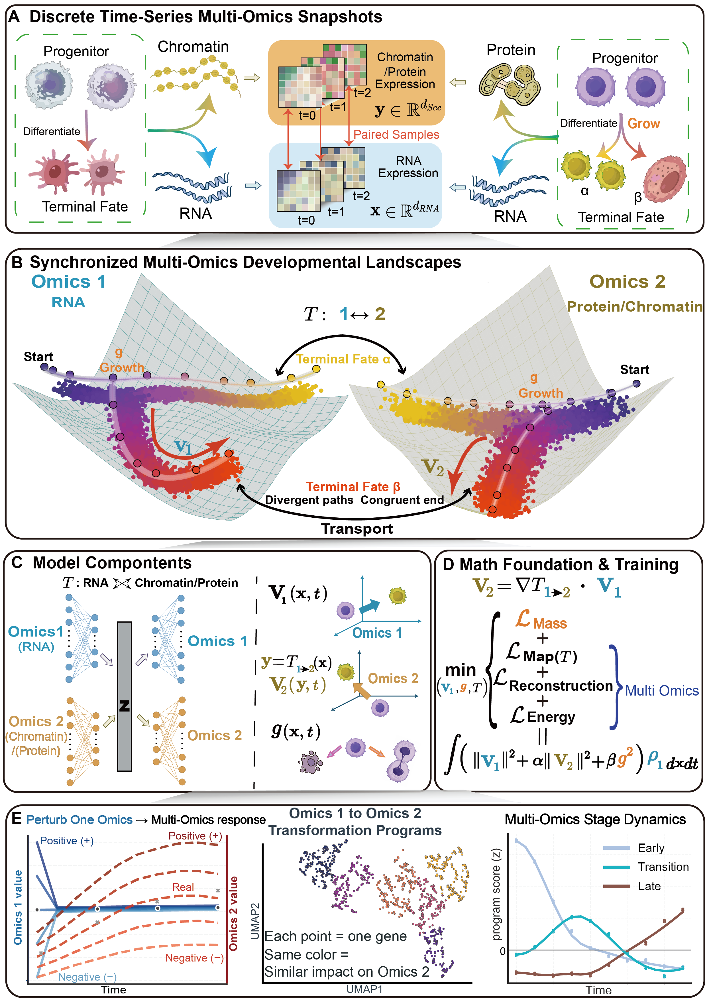

<div align="center">
  
  <h1>MOFI</h1>
  <p><b>Multi-Omics Fate Inference</b></p>
  <p>Continuous and synchronized dynamics from time-series single-cell multi-omics snapshots.</p>
</div>

<div align="center">
  <h3>Enjoying MOFI? Help the project grow by clicking the ⭐ button!</h3>
</div>

<div align="center">

[](https://www.python.org/)
[](LICENSE)
[](https://github.com/jiantaoShen12/MOFI_tmp/stargazers)
[](https://github.com/jiantaoShen12/MOFI_tmp/commits/main)
[](https://jiantaoshen12.github.io/MOFI_tmp/)

</div>

## MOFI: Multi-Omics Fate Inference

Like reconstructing a continuous movie from a few snapshots, MOFI learns how paired single-cell omics states evolve between measured time points. It combines cross-omics transformation, neural ODE dynamics, population growth and death, cell-fate inference, and perturbation analysis in one framework.

<div align="center">
  
</div>

## 🌟 Highlights

- **Synchronized multi-omics dynamics** — reconstruct coordinated RNA–ATAC or RNA–protein trajectories with a shared continuous-time interpretation.
- **Fate and population dynamics** — infer cell-type composition, developmental trajectories, proliferation, and death.
- **Cross-omics mechanisms** — analyze transformation programs, marker coupling, and perturbation propagation between modalities.
- **Reusable downstream analysis** — call the released `CytoBridge` library directly from concise tutorial notebooks.
- **Interactive exploration** — inspect compact trajectory and transformation demos in the [MOFI website](https://jiantaoshen12.github.io/MOFI_tmp/).

## 🛠 Installation

MOFI requires Python 3.9 or newer. Python 3.10 is recommended.

```bash
git clone https://github.com/jiantaoShen12/MOFI_tmp.git
cd MOFI_tmp

conda env create -f environment.yml
conda activate mofi
python -m pip install -e .
```

For an existing compatible environment:

```bash
python -m pip install -r requirements.txt
python -m pip install -e .
```

GPU acceleration is optional. Adjust the PyTorch/CUDA installation for your machine when the CUDA version differs from the supplied environment.

## 📦 Data and models

The public repository contains the small simulation datasets and the fitted Figure 2 simulation model. Real biological datasets and their trained models are intentionally not committed to Git history.

| Resource | Included in GitHub | Location |
| --- | --- | --- |
| Simulation inputs | Yes | [`datasets/simulation/`](datasets/simulation/) |
| Figure 2 fitted simulation object and checkpoints | Yes | [`models/simulation/figure2/`](models/simulation/figure2/) |
| Compact browser-demo assets | Yes | [`web/demo_data/`](web/demo_data/) |
| Real processed datasets | No | Paths reserved under `paper_data/processed/` |
| Real fitted dynamics objects | No | Paths reserved under `paper_data/dynamics/` |
| Real mapping and UMAP models | No | Paths reserved under `paper_data/maps/` and `paper_data/umap/` |

The complete expected file layout, byte counts, and SHA-256 checksums are recorded in [`data_manifest.yaml`](data_manifest.yaml). See [`paper_data/README.md`](paper_data/README.md) for the directory contract. When release assets are available, the downloader can populate these paths:

```bash
python scripts/download_data.py gse213152
python scripts/download_data.py hspc_31800
python scripts/download_data.py ho
python scripts/download_data.py hc_author5

# Verify files already placed under paper_data/.
python scripts/download_data.py --all --verify-only
```

The Figure 2 tutorial can train from zero. The bundled simulation model is provided as a convenient reproducible reference, not as a substitute for that training workflow.

## 📓 Tutorials and manuscript figures

Start Jupyter from the repository root:

```bash
jupyter lab
```

Each tutorial follows the same readable pattern: introduce the biological question, locate the input object, call one library function, display one result, and explain how to adapt the call to another dataset.

| Tutorial | Dataset / task | Main outputs |
| --- | --- | --- |
| [Figure 2](notebooks/00_simulation_training_and_figure2.ipynb) | Simulation benchmark | Training from zero, potential landscape, trajectories, growth, W1, and TMV. |
| [Figure 3](notebooks/01_gse213152_and_figure3.ipynb) | Kidney organoid RNA–ATAC | Synchronized trajectories, fate and marker dynamics, ODE trajectories, and growth. |
| [Figure 4](notebooks/02_hspc_31800_and_figure4.ipynb) | HSPC RNA–protein | Time slices, MkP perturbation, fate composition, ITGA2B–CD41, and transformation table. |
| [Figure 5](notebooks/03_human_organoid_and_figure5.ipynb) | Human organoid RNA–ATAC | Temporal programs, volcano result, NKX2-1, trajectories, and growth. |
| [Figure 6](notebooks/04_cortical_development_and_figure6.ipynb) | Human cerebral cortex RNA–ATAC | Time slices, lineage flow, ERBB4 perturbation, and fate composition. |

The notebooks call functions from `src/CytoBridge/`; they do not maintain separate copies of the analysis implementation. More details are available in the [reproducibility and extension guide](docs/reproducibility.md).

## 🌐 Interactive website

Visit the hosted site at **[jiantaoshen12.github.io/MOFI_tmp](https://jiantaoshen12.github.io/MOFI_tmp/)**.

To preview it locally:

```bash
python -m http.server 8000
```

Then open `http://localhost:8000/`. The website is self-contained under [`web/`](web/); its JSON files are compact sampled or illustrative browser assets, not the complete manuscript datasets.

## 🧬 Use MOFI on another dataset

The installed Python package exposes the public API as `CytoBridge`:

```python
import scanpy as sc
import CytoBridge as cb

adata = sc.read_h5ad("my_paired_data.h5ad")
adata = cb.pp.preprocess(
    adata,
    time_key="time",
    dim_reduction="PCA",
    normalization=True,
    log1p=True,
    select_hvg=True,
)

adata = cb.tl.fit(adata, config="ruot", device="cuda")
adata.write_h5ad("my_data_with_mofi_model.h5ad")
```

Start with the notebook closest to your modality pair, then change only the input paths and metadata keys before changing biological choices such as markers, source populations, perturbation scores, or displayed cell types.

## 🗂 Repository structure

```text
MOFI_tmp/
├── src/CytoBridge/        # Preprocessing, training, analysis, and plotting library
├── notebooks/             # Five manuscript-oriented tutorials
├── configs/               # Training, analysis, and perturbation configurations
├── datasets/simulation/   # Small public simulation datasets
├── models/simulation/     # Public fitted Figure 2 simulation model
├── downstream/plotting/   # Plotting implementations called by the library
├── scripts/               # Download, validation, and utility scripts
├── paper_data/            # Reserved paths for untracked real data and models
├── web/                   # Self-contained interactive website
└── data_manifest.yaml     # Expected real-data files, sizes, and checksums
```

## 📖 Citation

If you use MOFI, please cite the associated manuscript when its final bibliographic record is available. Until then, cite the software repository:

```bibtex
@software{mofi2026,
  author  = {Shen, Jiantao and Liu, Rui and Zhou, Peijie},
  title   = {MOFI: Multi-Omics Fate Inference},
  version = {0.2.0},
  year    = {2026},
  url     = {https://github.com/jiantaoShen12/MOFI_tmp}
}
```

Machine-readable metadata are provided in [`CITATION.cff`](CITATION.cff).

## 📢 News

- **2026-09-19** — Public code, interactive website, simulation data/model, and five tutorial notebooks prepared for release.

## 🏗 Contributing

Bug reports, portability fixes, dataset adapters, plotting utilities, and clearer examples are welcome. Please keep paths repository-relative, avoid committing real datasets or real-data checkpoints, and keep one result per notebook display cell. See [`CONTRIBUTING.md`](CONTRIBUTING.md).

## License

MOFI is released under the [MIT License](LICENSE). Dataset and manuscript assets may have additional provenance or redistribution conditions; consult the original accession records before redistribution.
