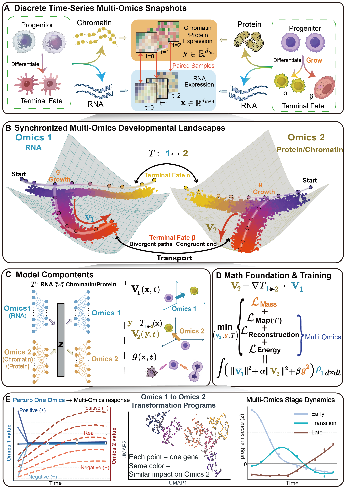

# MOFI: Multi-Omics Fate Inference

MOFI reconstructs continuous cell-state dynamics from time-series single-cell multi-omics data. It combines cross-modality mapping with models of cell-state change and population growth to study developmental trajectories, cell fates and molecular perturbations.



## System requirements

The core package import and a basic CUDA calculation were checked on Windows 11 Pro 25H2 with Python 3.10.20, PyTorch 2.6.0 and CUDA 12.4. The workstation has an NVIDIA GeForce RTX 4090 with 24 GB GPU memory. Linux and macOS have not been tested for this release.

The installed dependency versions in that environment are:

| Dependencies | Versions |
| --- | --- |
| PyTorch, torchvision, torchaudio | 2.6.0, 0.21.0, 2.6.0 (CUDA 12.4 builds) |
| NumPy, SciPy, pandas, scikit-learn | 1.26.4, 1.15.3, 2.3.3, 1.7.1 |
| Scanpy, AnnData, h5py, umap-learn | 1.11.3, 0.11.4, 3.14.0, 0.5.12 |
| torchdiffeq, torchsde, POT, GeomLoss | 0.2.5, 0.2.6, 0.9.7, 0.2.6 |
| PHATE, scVelo | 2.0.0, 0.3.3 |
| Matplotlib, seaborn, Plotly, Kaleido | 3.10.9, 0.13.2, 7.0.0, 0.2.1 |
| PyYAML, tqdm, joblib, ipywidgets | 6.0.2, 4.67.1, 1.5.3, 8.1.7 |

An NVIDIA GPU is recommended for model training. The simulation training script also accepts `--device cpu`, although CPU runs take longer. A desktop with 16 GB RAM is recommended for the small simulation; larger biological datasets may need more memory. No specialised hardware is needed to view the saved notebook figures or the web demo.

## Getting started

From the repository root:

```bash
git clone https://github.com/jiantaoShen12/MOFI.git
cd MOFI
conda create -n mofi python=3.10 -y
conda activate mofi
python -m pip install -r requirements.txt
python -m pip install -e .
jupyter lab
```

Installation typically takes around 10–30 minutes on a desktop computer, depending on the internet connection and dependency downloads.

The simulation notebook includes model fitting and evaluation. The biological examples use fitted models and processed data placed under `paper_data/`; see the [data notes](paper_data/README.md). These biological data and models are not included in the repository.

## Examples

The notebooks cover a simulation benchmark and four biological datasets.

| Notebook | Analysis |
| --- | --- |
| [Simulation](notebooks/00_simulation_training_and_figure2.ipynb) | Trajectories, potential landscape and growth rates |
| [Kidney organoids](notebooks/01_gse213152_and_figure3.ipynb) | RNA–ATAC dynamics, cell fates and marker expression |
| [HSPCs](notebooks/02_hspc_31800_and_figure4.ipynb) | RNA–protein dynamics and MkP perturbation |
| [Human organoids](notebooks/03_human_organoid_and_figure5.ipynb) | Developmental programs and NKX2-1 dynamics |
| [Cortical development](notebooks/04_cortical_development_and_figure6.ipynb) | Lineage transitions and ERBB4 perturbation |

## Simulation runtime

Open `notebooks/00_simulation_training_and_figure2.ipynb` to run the supplied simulation. The recorded simulation training run took approximately **152 seconds** using CUDA. This timing excludes installation and downstream figure generation.

## Code

Paths below are relative to the repository root.

| Directory | Contents |
| --- | --- |
| `src/` | MOFI implementation in `CytoBridge/`, with the `mofi/` import alias. `Map/` handles cross-modality mapping, `tl/` model fitting and dynamics, `pp/` preprocessing, and `pl/` plotting and perturbation analysis. |
| `configs/` | Training, analysis and perturbation settings, with selected cell indices and gene lists in `analysis_inputs/`. |
| `notebooks/` | Simulation training and analyses for Figures 2–6; `mofi_notebook.py` provides shared notebook helpers. |
| `scripts/` | Notebook execution and simulation data generation, training, evaluation and plotting. |
| `datasets/simulation/` | Simulation inputs and reference gene-expression values. |
| `models/simulation/` | Fitted simulation models and evaluation results. |
| `downstream/plotting/` | Additional plotting routines for the biological analyses. |
| `paper_data/` | Notes on the external biological data and fitted models needed by the notebooks. |
| `web/` | Interactive website, paper figures in `assets/`, and sampled trajectories in `demo_data/`. |

## Interactive examples

The [web demo](https://jiantaoshen12.github.io/MOFI/) shows simulated and kidney organoid trajectories. To view it locally, run this command from the repository root:

```bash
python -m http.server 8000 --directory web
```

Open <http://localhost:8000/> in your browser. The demo uses sampled trajectories and illustrative animations; it does not run model inference.

## Citation

The paper citation will be added after publication.

## License

[MIT](LICENSE).
